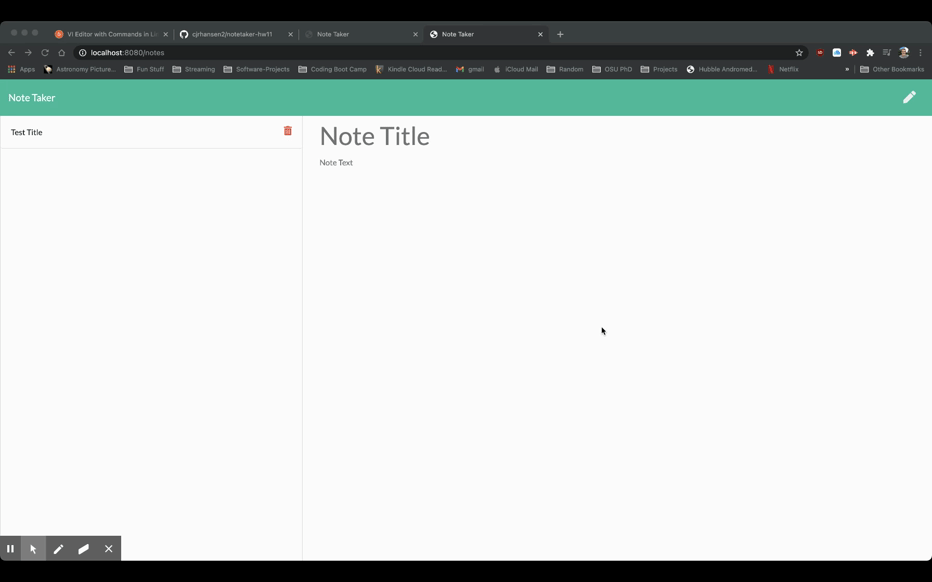

# notetaker-hw11

## Description
This is an application that lets me practice using express.js to create servers linking back end and front end. This specific application allows for simple notetaking. You can create notes, add them, save them, and delete them.

## Installation
Download the files and open them in a new terminal window. 
Use `npm init` to initialize, then `npm install` to get express and other dependencies. Then run `node server.js`

Alternatively, visit the application hosted on Heroku at this url: https://shrouded-falls-03441.herokuapp.com/

## Usage
Link to video running the app: https://drive.google.com/file/d/1fxC1zuFVaQHZB_9tcjhdFR3qzQ5KzZv0/view

## Credits
Code by CJ Hansen: https://github.com/cjrhansen2
